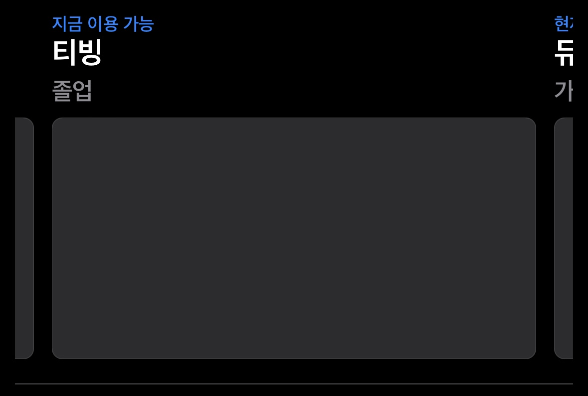
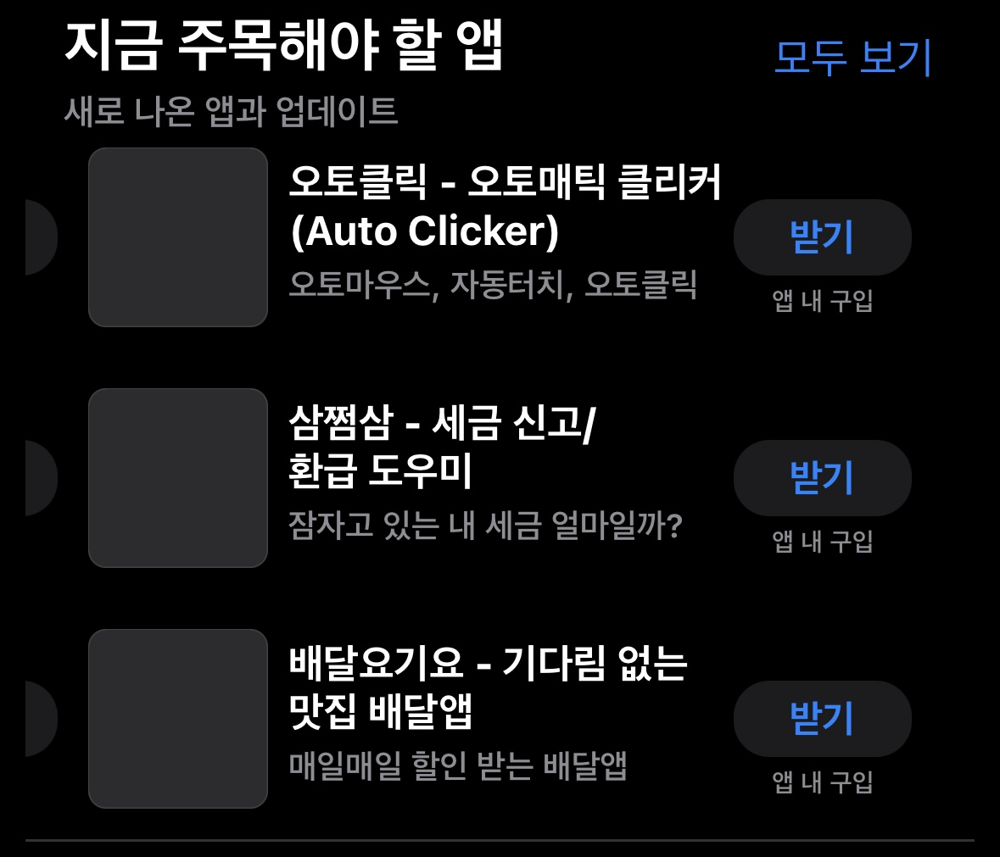
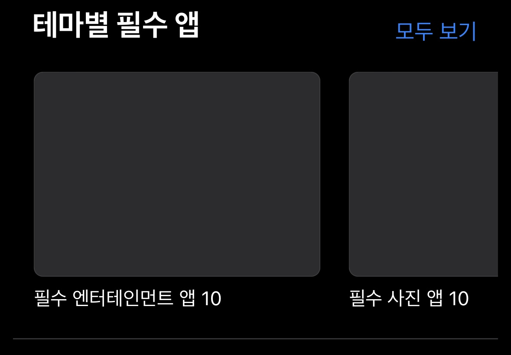

# Compositional Layout + Diffable DataSource를 적용한 데모 프로젝트

- AppStore 앱 레이아웃을 클론하여 구현 
- Compositional 과 Diffable DataSource 적용
- 코드 작성 편의성을 위한 SnapKit 과 Then 라이브러리 사용
- iOS 14+
  
## Compositional Layout
### Compositional Layout 정의
하나의 콜렉션 뷰에 섹션 별로 다른 레이아웃 정의

```
private lazy var collectionView = UICollectionView(
    frame: .zero,
    collectionViewLayout: UICollectionViewCompositionalLayout { section, env -> NSCollectionLayoutSection? in
        guard let sectionKind = AppSection(rawValue: section) else { return nil }
        switch sectionKind {
        case .feature:
            return self.getLayoutFeatureSection()
        case .rankingFeature:
            return self.getLayoutRankingFeatureSection()
        case .themeFeature:
            return self.getLayoutThemeFeatureSection()
        }
    }).then {
        $0.showsHorizontalScrollIndicator = false
        $0.contentInset = .zero
    }
```

### Section 정의
```
enum AppSection: Int, Hashable, CaseIterable {
    case feature
    case rankingFeature
    case themeFeature
    
    var headerTitle: String? {
        switch self {
        case .feature:
            return nil
        case .rankingFeature:
            return "지금 주목해야 할 앱"
        case .themeFeature:
            return "테마별 필수 앱"
        }
    }
    
    var description: String? {
        switch self {
        case .feature:
            return nil
        case .rankingFeature:
            return "새로 나온 앱과 업데이트"
        case .themeFeature:
            return nil
        }
    }
}
```

### Feature 섹션 레이아웃 정의


이전 및 다음 아이템 노출을 위해 group .fractionalWidth(0.9) 설정 및 horizontal로 설정
```
func getLayoutFeatureSection() -> NSCollectionLayoutSection {
    let itemSize = NSCollectionLayoutSize(
        widthDimension: .fractionalWidth(1.0),
        heightDimension: .fractionalHeight(1.0)
    )
    
    let item = NSCollectionLayoutItem(layoutSize: itemSize)
    item.contentInsets  = NSDirectionalEdgeInsets(top: 8, leading: 6, bottom: 8, trailing: 6)
    
    let groupSize = NSCollectionLayoutSize(
        widthDimension: .fractionalWidth(0.9),
        heightDimension: .fractionalHeight(0.3)
    )
    let group = NSCollectionLayoutGroup.horizontal(layoutSize: groupSize, subitems: [item])
    
    let section = NSCollectionLayoutSection(group: group)
    section.orthogonalScrollingBehavior = .groupPagingCentered
    
    let sectionFooter = NSCollectionLayoutBoundarySupplementaryItem(
        layoutSize: NSCollectionLayoutSize(widthDimension: .fractionalWidth(1.0), heightDimension: .absolute(1)),
        elementKind: SupplementaryKind.footer,
        alignment: .bottom
    )
    section.boundarySupplementaryItems = [sectionFooter]
    
    return section
}
```

### Ranking Feature 섹션 정의
      

이전 또는 다음 아이템 노출을 위해 group `.fractionalWidth(0.9)` 설정 

한 Group 당 3개의 item을 노출하기 위해 group `.fractionalHeight(1.0/3.0)` 설정

```
func getLayoutRankingFeatureSection() -> NSCollectionLayoutSection {
    // Item
    let itemSize = NSCollectionLayoutSize(
        widthDimension: .fractionalWidth(1.0),
        heightDimension: .fractionalHeight(1.0)
    )
    let item = NSCollectionLayoutItem(layoutSize: itemSize)
    item.contentInsets  = NSDirectionalEdgeInsets(top: 8, leading: 6, bottom: 8, trailing: 6)
    
    // Group
    let groupSize = NSCollectionLayoutSize(
        widthDimension: .fractionalWidth(0.9),
        heightDimension: .fractionalHeight(1.0/3.0)
    )
    let group = NSCollectionLayoutGroup.vertical(layoutSize: groupSize, subitem: item, count: 3)
    
    // Section
    let section = NSCollectionLayoutSection(group: group)
    section.orthogonalScrollingBehavior = .groupPagingCentered
    let sectionHeader = configureSectionHeader()
    let sectionFooter = configureSeparatorFooter()
    section.boundarySupplementaryItems = [sectionHeader, sectionFooter]
    
    return section
}
```

### Theme Feature 섹션 정의


다음 아이템 노출을 위해 group `.fractionalWidth(0.65)` 설정

```
func getLayoutThemeFeatureSection() -> NSCollectionLayoutSection {
    // Item
    let itemSize = NSCollectionLayoutSize(
        widthDimension: .fractionalWidth(1.0),
        heightDimension: .fractionalHeight(1.0)
    )
    let item = NSCollectionLayoutItem(layoutSize: itemSize)
    item.contentInsets  = NSDirectionalEdgeInsets(top: 8, leading: 6, bottom: 8, trailing: 6)
    
    // Group
    let groupSize = NSCollectionLayoutSize(
        widthDimension: .fractionalWidth(0.65),
        heightDimension: .fractionalHeight(0.25)
    )
    let group = NSCollectionLayoutGroup.horizontal(layoutSize: groupSize, subitems: [item])
    group.contentInsets = NSDirectionalEdgeInsets(top: 0, leading: 10, bottom: 0, trailing: 0)
    
    // Section
    let section = NSCollectionLayoutSection(group: group)
    section.orthogonalScrollingBehavior = .groupPaging
    let sectionHeader = configureSectionHeader()
    let sectionFooter = configureSeparatorFooter()
    section.boundarySupplementaryItems = [sectionHeader, sectionFooter]
    
    return section
}
```

### 헤더 및 푸터 정의
```
private enum SupplementaryKind {
    static let header = "section-header-element-kind"
    static let footer = "section-footer-element-kind"
}

func configureSectionHeader() -> NSCollectionLayoutBoundarySupplementaryItem {
    return NSCollectionLayoutBoundarySupplementaryItem(
        layoutSize: NSCollectionLayoutSize(
            widthDimension: .fractionalWidth(1.0),
            heightDimension: .estimated(50)
        ),
        elementKind: SupplementaryKind.header,
        alignment: .top
    )
}

func configureSeparatorFooter() -> NSCollectionLayoutBoundarySupplementaryItem {
    return NSCollectionLayoutBoundarySupplementaryItem(
        layoutSize: NSCollectionLayoutSize(
            widthDimension: .fractionalWidth(1.0),
            heightDimension: .absolute(1)
        ),
        elementKind: SupplementaryKind.footer,
        alignment: .bottom
    )
}
```

## Diffable DataSource
### Section 및 Item 정의
Hashable 프로토콜 채택
```
enum AppSection: Int, Hashable, CaseIterable {
    case feature
    case rankingFeature
    case themeFeature
    
    var headerTitle: String? {
        switch self {
        case .feature:
            return nil
        case .rankingFeature:
            return "지금 주목해야 할 앱"
        case .themeFeature:
            return "테마별 필수 앱"
        }
    }
    
    var description: String? {
        switch self {
        case .feature:
            return nil
        case .rankingFeature:
            return "새로 나온 앱과 업데이트"
        case .themeFeature:
            return nil
        }
    }
}

enum AppSectionItem: Hashable {
    case feature(Feature)
    case rankingFeature(RankingFeature)
    case themeFeature(ThemeFeature)
}

struct Feature: Hashable {
    let type: String
    let title: String
    let description: String
    private let identifier = UUID()
}

struct RankingFeature: Hashable {
    let title: String
    let description: String
    let isInAppPurchase: Bool
    private let identifier = UUID()
}

struct ThemeFeature: Hashable {
    let title: String
    private let identifier = UUID()
}
```

### Cell 등록 및 DataSource 정의

```
fileprivate typealias AppDataSource = UICollectionViewDiffableDataSource<AppSection, AppSectionItem>
private typealias FeatureRegistration = UICollectionView.CellRegistration<FeatureCell, Feature>
private typealias RankingFeatureRegistration = UICollectionView.CellRegistration<RankingFeatureCell, RankingFeature>
private typealias ThemeFeatureRegistration = UICollectionView.CellRegistration<ThemeFeatureCell, ThemeFeature>

private lazy var appDataSource = configureAppDataSource()

func configureAppDataSource() -> AppDataSource {
    let featureCellRegistration = FeatureRegistration { cell, _ , feature in
        cell.prepare(with: feature)
    }
    let rankingFeatureCellRegistration = RankingFeatureRegistration { cell, _ , feature in
        cell.prepare(with: feature)
    }
    let themeFeatureCellRegistration = ThemeFeatureRegistration { cell, _, feature in
        cell.prepare(with: feature)
    }
    
    return AppDataSource(collectionView: collectionView) { collectionView, indexPath, listItem in
        switch listItem {
        case .feature(let feature):
            return collectionView.dequeueConfiguredReusableCell(
                using: featureCellRegistration,
                for: indexPath,
                item: feature
            )
        case .rankingFeature(let feature):
            return collectionView.dequeueConfiguredReusableCell(
                using: rankingFeatureCellRegistration,
                for: indexPath,
                item: feature
            )
        case .themeFeature(let feature):
            return collectionView.dequeueConfiguredReusableCell(
                using: themeFeatureCellRegistration,
                for: indexPath,
                item: feature
            )
        }
    }
}
```

### Header 및 Footer 등록
```
private typealias HeaderRegistration = UICollectionView.SupplementaryRegistration<HeaderView>
private typealias FooterRegistration = UICollectionView.SupplementaryRegistration<FooterView>

func configureSupplementaryViewRegistration() {
    let headerRegistration = HeaderRegistration(elementKind: SupplementaryKind.header) { view, _, indexPath in
        if let section =  AppSection(rawValue: indexPath.section) {
            view.prepare(title: section.headerTitle, description: section.description)
        }
    }
    
    let footerRegistration = FooterRegistration(elementKind: SupplementaryKind.footer, handler: { _, _, _ in })
    
    appDataSource.supplementaryViewProvider = { [weak self] _ , kind, index in
        switch kind {
        case SupplementaryKind.header:
            return self?.collectionView.dequeueConfiguredReusableSupplementary(using: headerRegistration, for: index)
        case SupplementaryKind.footer:
            return self?.collectionView.dequeueConfiguredReusableSupplementary(using: footerRegistration, for: index)
        default:
            return UICollectionReusableView()
        }
    }
}
```

### Mock 데이터 스냅샷 적용
```
func applyInitialSnapshots() {
    var snapshot = NSDiffableDataSourceSnapshot<AppSection, AppSectionItem>()
    
    let sections = AppSection.allCases
    snapshot.appendSections(sections)
    
    snapshot.appendItems(Mocks.features, toSection: .feature)
    snapshot.appendItems(Mocks.rankingFeatures, toSection: .rankingFeature)
    snapshot.appendItems(Mocks.themeFeatures, toSection: .themeFeature)
    
    appDataSource.apply(snapshot, animatingDifferences: true)
}
```

## 💡 인사이트

### Compositional Layout
기존 레이아웃으로는 TableView에 CollectionView를 함께 사용하여 구현했음.   
- 뎁스가 많아지고 코드량이 많아져 공수가 더 소요되었음.  

Compositional Layout을 사용해서 구현했을 때, 하나의 CollectionView로 섹션에 따라 다양하고 복잡한 레이아웃을 간편하게 만들 수 있었음.  
- 기존 레이아웃에 비해 뎁스가 줄어들고 성능이 높아짐.
- 복잡한 레이아웃을 선언형 API로 간단하게 구축할 수 있음.

### Diffable DataSource
기존 DataSource방식에서는 시간이 지남에 따라 변하는 버전이 맞지 않는 이슈(UI와 DataSource 맞지 않음)가 있어 `reloadData()` 호출을 통해 해결했음. 하지만 애니메이션이 적용되지 않아 사용자 경험이 저하됨.
- 위와 같은 이슈를 해결하기 위해 UI와 DataSource를 중앙화하여 관리하므로 이슈가 해결되었음.
- IndexPath가 아닌 Snapshot을 사용하고 Snapsoht의 Section 및 Item identifier (Unique identifier, Hashable 준수)를 이용하여 UI 업데이트함.
- 데이터가 변경될 때마다 새로운 Snapshot을 생성하고 이를 다시 DataSource에 적용하는 과정에서 애니메이션을 통해 자연스럽게 업데이트할 수 있음.

-> 변경사항이 있을 때 애니메이션이 적용되어 자연스럽게 업데이트되는 것과 UI와 DataSource 간에 버전이 맞지 않아 크래시나 에러가 발생할 일이 없음.    
-> Hashable 기반으로 O(n)의 빠른 성능을 가지고 있음. (기존 DataSource는 일반적으로 O(n^2))